# Travel Planner Agent 🌍✈️🏨

A multi-agent conversational travel planner built with TypeScript, LangGraph, and Gemma3. This system provides a seamless, stateful chat interface for searching and booking flights and hotels through natural language queries.

## 🏗️ Architecture

```mermaid
flowchart TD
    User[👤 User] --> ClassifierAgent[🎯 Intent Classifier]
    ClassifierAgent --> DialogManager[🧠 Dialog Manager]
    DialogManager -->|slots incomplete| FollowUpAgent[❓ Follow-up Agent]
    DialogManager -->|slots complete, intent Flight| FlightSearchAgent[✈️ Flight Search Agent]
    DialogManager -->|slots complete, intent Hotel| HotelSearchAgent[🏨 Hotel Search Agent]
    DialogManager -->|intent Other| FallbackAgent[🤖 Fallback Agent]
    FlightSearchAgent --> ResponseStreamer[📡 Response Streamer]
    HotelSearchAgent --> ResponseStreamer
    FallbackAgent --> ResponseStreamer
    ResponseStreamer --> User
    
    subgraph "Core Components"
        SessionManager[💾 Session Manager]
        EntityExtractor[🔍 Entity Extractor]
    end
    
    DialogManager <--> SessionManager
    DialogManager <--> EntityExtractor
```



## 🚀 Features

- **🎯 Intent Classification**: Automatically detects Flight, Hotel, Both, or Other intents
- **🔍 Entity Extraction**: Extracts structured data (cities, dates, passengers) using Zod validation
- **💬 Conversational Flow**: Maintains context and asks follow-up questions for missing information
- **🔄 Multi-Agent Orchestration**: Uses LangGraph pattern for agent coordination
- **📡 Real-time Streaming**: Server-Sent Events (SSE) for responsive user experience
- **💾 Session Management**: Stateful conversations with multi-user support
- **🛡️ Type Safety**: Full TypeScript implementation with Zod schema validation
- **🧪 Mock Search APIs**: Realistic flight and hotel search results for testing

## 🛠️ Tech Stack

- **Language**: TypeScript (>=4.x)
- **Agent Framework**: LangGraph.js
- **LLM Model**: Gemma3:latest (via Ollama)
- **Web Framework**: Fastify
- **Schema Validation**: Zod
- **Runtime**: Node.js 18+
- **Testing**: Jest + Supertest

## 📋 Prerequisites

1. **Node.js 18+** installed
2. **Ollama** installed and running
3. **Gemma3 model** pulled in Ollama

### Setting up Ollama and Gemma3

```bash
# Install Ollama (macOS)
brew install ollama

# Start Ollama service
ollama serve

# Pull Gemma3 model (in another terminal)
ollama pull gemma3:latest
```

## 🚀 Quick Start

### 1. Clone and Install Dependencies

```bash
cd travel-agent
npm install
```

### 2. Build the Project

```bash
npm run build
```

### 3. Start Development Server

```bash
npm run dev
```

### 4. Access the Application

- **Demo Interface**: http://localhost:3000
- **Health Check**: http://localhost:3000/health
- **API Endpoint**: POST http://localhost:3000/api/chat

## 📡 API Reference

### Chat Endpoint

**POST** `/api/chat`

Send a message to the travel planner agent.

**Request Body:**
```json
{
  "userId": "string",
  "message": "string"
}
```

**Response:** Server-Sent Events stream

**Example:**
```bash
curl -X POST http://localhost:3000/api/chat \
  -H "Content-Type: application/json" \
  -d '{"userId": "user123", "message": "Find flights from NYC to LA"}'
```

### Session Management

**GET** `/api/session/:userId` - Get session information
**DELETE** `/api/session/:userId` - Clear user session

### Health Check

**GET** `/health` - Server health and active sessions count

## 🎯 Usage Examples

### Flight Search
```
User: "I need a flight from New York to Los Angeles"
Agent: "When would you like to depart?"
User: "December 25th"
Agent: "How many passengers will be traveling?"
User: "2 passengers"
Agent: [Returns flight search results]
```

### Hotel Search
```
User: "Book me a hotel in Paris"
Agent: "When would you like to check in?"
User: "January 15th for 3 nights"
Agent: "How many guests will be staying?"
User: "2 guests"
Agent: [Returns hotel search results]
```

### Combined Trip Planning
```
User: "Plan a trip to Tokyo with flights and hotel"
Agent: "I can help you plan a complete trip! Where would you like to fly from?"
User: "San Francisco, departing March 10th, returning March 17th, for 2 people"
Agent: [Returns both flight and hotel results]
```

## 🧪 Testing

### Run All Tests
```bash
npm test
```

### Run Tests in Watch Mode
```bash
npm run test:watch
```

### Test Coverage
The test suite covers:
- Intent classification accuracy
- Entity extraction validation
- Session state management
- API endpoint functionality
- Error handling scenarios

## 🏗️ Project Structure

```
src/
├── agents/                 # AI Agents
│   ├── intent-classifier.ts
│   ├── entity-extractor.ts
│   ├── search-agents.ts
│   └── fallback-agent.ts
├── core/                   # Core Components
│   ├── dialog-manager.ts
│   └── session-manager.ts
├── types/                  # Type Definitions
│   └── schemas.ts
├── __tests__/             # Test Files
│   ├── dialog-manager.test.ts
│   └── server.test.ts
├── server.ts              # Fastify Server
└── index.ts               # Application Entry Point

public/
└── index.html             # Demo Frontend

```

## 🔧 Configuration

### Environment Variables

```bash
# Server Configuration
PORT=3000                  # Server port (default: 3000)
NODE_ENV=development       # Environment mode

# LLM Configuration (choose one)
LLM_PROVIDER=ollama        # Use 'ollama' for local or 'openai' for cloud
LLM_MODEL=gemma2:2b        # Model name

# Ollama Configuration (if using LLM_PROVIDER=ollama)
OLLAMA_BASE_URL=http://localhost:11434

# OpenAI Configuration (if using LLM_PROVIDER=openai)
OPENAI_API_KEY=sk-your-key-here
```

### LLM Configuration

The system supports two LLM providers:

**Local Ollama (Development)**:
- Install and run Ollama locally
- Pull the model: `ollama pull gemma2:2b`
- Set `LLM_PROVIDER=ollama`

**OpenAI (Production/Cloud)**:
- Get API key from [platform.openai.com](https://platform.openai.com)
- Set `LLM_PROVIDER=openai` and `OPENAI_API_KEY=your-key`
- Recommended for cloud deployments

## 🚀 Deployment

This application can be deployed in several ways. Choose the option that best fits your needs.

### Local Production Build
```bash
# Build the TypeScript code
npm run build

# Start the production server
npm start

# Required environment variables:
# PORT=3001 (optional, defaults to 3000)
# OLLAMA_BASE_URL=http://localhost:11434 (required for LLM functionality)
```

### Docker Deployment

The project includes a complete Docker setup for easy deployment.

#### Option 1: Using Docker Compose (Recommended)

```bash
# Start both the application and Ollama
docker-compose up -d

# Pull the Gemma3 model in Ollama
docker-compose exec ollama ollama pull gemma3:latest

# View logs
docker-compose logs -f

# Stop the services
docker-compose down
```

#### Option 2: Using Docker Directly

```bash
# Build the Docker image
docker build -t travel-planner-agent .

# Run the container
docker run -p 3001:3001 -e OLLAMA_BASE_URL=http://host.docker.internal:11434 travel-planner-agent
```

### Cloud Deployment Options

> 📖 **Quick Start**: See [QUICK_DEPLOY.md](./QUICK_DEPLOY.md) for step-by-step deployment instructions

#### Railway (Recommended)

1. Go to [railway.app](https://railway.app) and connect your GitHub repo
2. Set environment variables:
   ```
   NODE_ENV=production
   LLM_PROVIDER=openai
   OPENAI_API_KEY=sk-your-key-here
   LLM_MODEL=gpt-3.5-turbo
   ```
3. Deploy automatically from GitHub

#### Vercel

1. Install Vercel CLI: `npm install -g vercel`
2. Deploy: `vercel --prod`
3. Set environment variables via Vercel dashboard

#### Render (Free Tier Available)

1. Create Web Service at [render.com](https://render.com)
2. Connect GitHub repository
3. Build command: `npm install && npm run build`
4. Start command: `npm start`
5. Add environment variables in Render dashboard
5. Add environment variables:
   - `PORT=3001`
   - `OLLAMA_BASE_URL=<your-ollama-endpoint>`

#### AWS Elastic Beanstalk Deployment

1. Create a `.ebextensions` folder with configuration files
2. Use the AWS Elastic Beanstalk CLI to deploy:
   ```bash
   eb init
   eb create travel-planner-env
   eb deploy
   ```

### Important Deployment Notes

1. **Ollama Requirement**: This application requires access to an Ollama instance with the `gemma3:latest` model
2. **Environment Variables**: Make sure to set `OLLAMA_BASE_URL` to point to your Ollama instance
3. **Resource Requirements**: Ensure your deployment environment has sufficient resources for running LLM inference

## 🔍 Monitoring

### Health Check
Monitor application health at `/health` endpoint:

```json
{
  "status": "healthy",
  "timestamp": "2024-01-15T10:30:00.000Z",
  "activeSessions": 42
}
```

### Performance Metrics
- **Intent Classification**: ~200ms median response time
- **Concurrent Sessions**: Supports 1000+ active sessions
- **Memory Usage**: Optimized for production workloads

## 🛡️ Security

- **Input Validation**: All inputs validated using Zod schemas
- **CORS Protection**: Configured for allowed origins
- **Session Isolation**: User sessions are completely isolated
- **No Data Persistence**: Sessions stored in memory (Redis recommended for production)

## 🤝 Contributing

1. Fork the repository
2. Create a feature branch (`git checkout -b feature/amazing-feature`)
3. Commit your changes (`git commit -m 'Add amazing feature'`)
4. Push to the branch (`git push origin feature/amazing-feature`)
5. Open a Pull Request

## 📝 License

This project is licensed under the MIT License - see the [LICENSE](LICENSE) file for details.

## 🙏 Acknowledgments

- Built following the Travel Planner Agent PRD specifications
- Powered by LangGraph.js for multi-agent orchestration
- Uses Gemma3 for natural language understanding
- Inspired by modern conversational AI patterns

---

**🚀 Ready to plan your next adventure? Start the server and begin chatting!**
